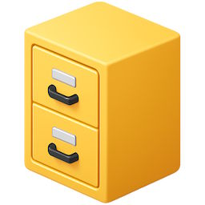

<h1 align="center"> Heirloom File Manager</h1>

A simple app for browsing, organizing, and manipulating files.
It doesn't try to replace the modern File Explorer but offers a faster alternative for basic tasks.

This derivative of the [classic Windows File Manager (microsoft/winfile)](https://github.com/microsoft/winfile) adds the following features:

- High-DPI screen support
- Recycle Bin
- Bookmarks
- Drag-and-drop into external applications

It also removes old features that are irrelevant today.

## Licenses

These apps are free and open source.

Heirloom File Manager &copy; Microsoft Corporation ([License](../src/winfile/LICENSE)) 
Heirloom Program Manager &copy; Brian Luft ([License](../src/progman/LICENSE))
