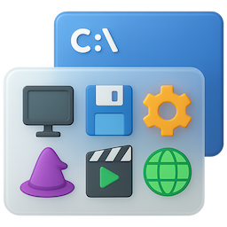

<h1 align="center">&nbsp; Heirloom apps</h1>

<h3 align="center">Lightly modernized classics for Windows</h3>

### Heirloom Program Manager
An alternative to the Start menu for launching shortcuts with the mouse. This is a reimplementation of the classic Program Manager.

### Heirloom File Manager
Browse, organize, and manipulate files. An alternative to File Explorer for basic tasks. This direct derivative of the [classic Windows File Manager](https://github.com/microsoft/winfile) adds the following features:

- High-DPI screen support
- Recycle Bin
- Bookmarks
- Drag-and-drop into external applications

## Licenses

These apps are free and open source.

Heirloom File Manager &copy; Microsoft Corporation ([License](../src/winfile/LICENSE)) 
Heirloom Program Manager &copy; Brian Luft ([License](../src/progman/LICENSE))
