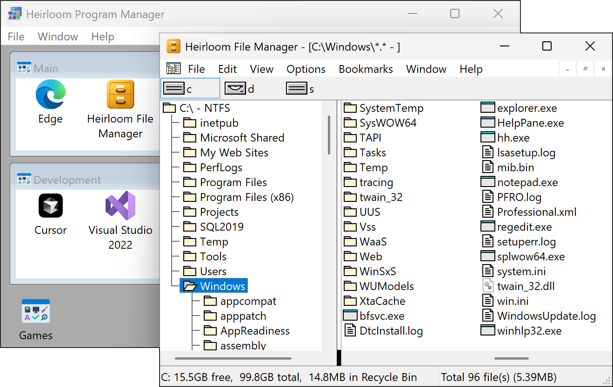

<h1 align="center"> File Manager</h1>

A simple app for browsing, organizing, and manipulating files.
It doesn't try to replace the modern File Explorer but offers a faster alternative for basic tasks.

This derivative of the [classic Windows File Manager (microsoft/winfile)](https://github.com/microsoft/winfile) adds the following features:

- High-DPI screen support
- Drag-and-drop from File Manager into external applications

It also removes old features that are irrelevant today.

## License

Copyright (c) Microsoft Corporation. All rights reserved.

Licensed under the [MIT](../LICENSE) License.
